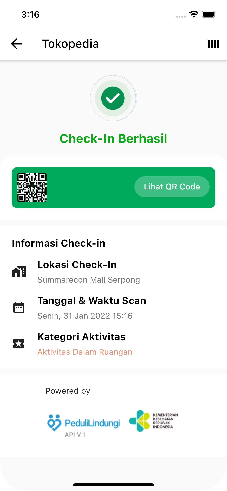
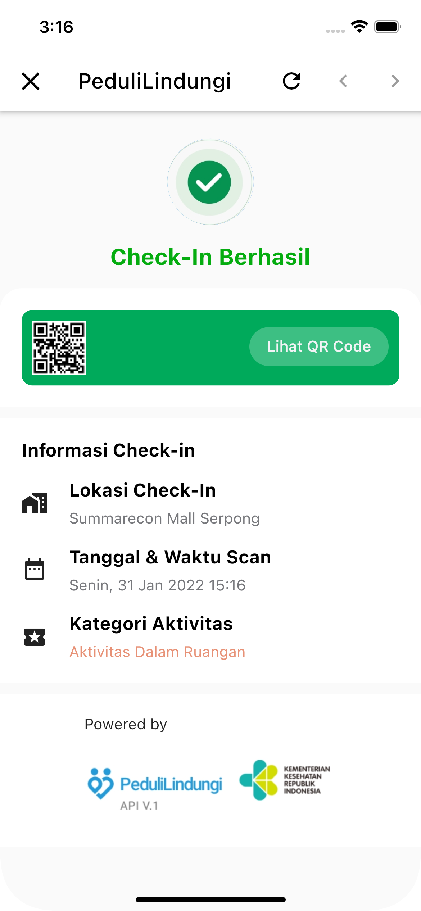
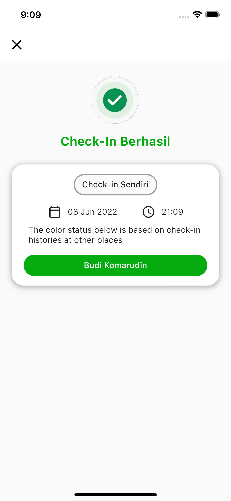

# plclone

Peduli Lindungi Clone (experimental only)

## App Description

This project is a clone of Peduli Lindungi that exist in some platform, like Tokopedia and Gojek that used for check in into a place where this app could display what you want to be without actually check-in into the government database (without hit the API).

## Disclaimer

This app must not to be used for check in into crucial places and by using this app, all of your action must be under your own responsibility along with the risk.

## What's New

Version 1.2.0
- Add new platform (Peduli Lindungi)
- Add Settings page to customize variable

Version 1.1.0
Initial Release.
Platform Supported:
- Tokopedia
- Gojek

## Todo

- [x] Tokopedia
      
- [x] Gojek
      
- [ ] MyTelkomsel
- [ ] Shopee

- [x] Peduli Lindungi
      
- [x] Settings Page
      

